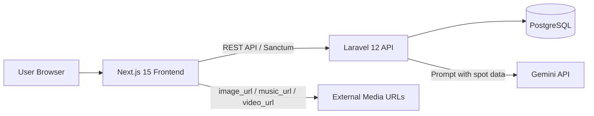

# システム設計

## 目的

「日本神秘紀行 ～神々の記憶を巡る旅～」は、ユーザーが日本地図から神秘スポットを巡り、神話クイズと御朱印収集を通してスポットを解放しながら、神話・歴史・伝説・絶景・BGM・AIガイドを楽しむWebアプリです。

観光予約や実用検索を主目的にせず、ゲームを進めるような収集体験と幻想的な探索体験を優先します。

## 全体構成

## アプリケーション構成

| レイヤー | 技術 | 役割 |
| --- | --- | --- |
| Frontend | Next.js 15 / TypeScript | 画面、地図、図鑑、BGM UI、AIチャットUI |
| Styling | TailwindCSS | 和風ファンタジーUI、グラスモーフィズム、レスポンシブ |
| Animation | Framer Motion | フェード、カードズーム、ページ遷移、背景パララックス |
| Map | React Leaflet | 日本地図、スポットピン、波紋エフェクト |
| Data Fetch | TanStack Query | API取得、キャッシュ、ローディング制御 |
| State | Zustand | BGM再生状態、選択スポット、UIモード |
| Backend | Laravel 12 API mode | 認証、REST API、Gemini連携 |
| Auth | Laravel Sanctum | SPA向けセッション認証 |
| Database | PostgreSQL | ユーザー、スポット、解放状態、称号 |
| AI | Gemini API | スポット文脈つきAI旅ガイド |

## バックエンド方針

- Laravel標準のController / Model / Migration / Seederを中心にする。
- Repository層やDDDは採用せず、初心者が追いやすい構成にする。
- ビジネスロジックが増える部分のみ、Serviceクラスへ分離する。
- AI連携は `AiGuideService` に集約し、Controllerを薄く保つ。
- APIレスポンスは必要に応じてResourceクラスで整形する。

## フロントエンド方針

- `app/` ルーターを採用する。
- 画面単位のコンポーネントと、再利用UIコンポーネントを分ける。
- 地図、BGM、解放演出、AIチャットなど状態を持つ領域は責務を小さく分割する。
- lucide-reactのみをアイコンとして使い、画像アイコンは使わない。
- 画像がない場合はデフォルト幻想背景を表示する。
- 音楽がない場合は再生UIに「BGM準備中」を表示する。

## 認証・ユーザー体験

MVPではメールアドレス・パスワード認証を前提にします。

未ログインでも以下は閲覧可能にします。

- ホーム
- 日本地図
- スポット一覧
- スポット詳細の概要

ログイン後に利用できる機能は以下です。

- 神話クイズによるスポット解放
- コレクション登録
- 神秘ポイント獲得
- 称号獲得
- AI旅ガイド
- マイページ

## 解放・ポイント・称号の基本仕様

### スポット解放

スポット解放は、手動ボタンではなく御朱印獲得をきっかけに行います。

ユーザーがスポットごとの神話クイズで4問中3問以上正解すると、`user_stamps` に御朱印獲得履歴を保存し、同時に `user_spots` と `collections` に解放状態を保存します。

すでに御朱印獲得済み・解放済みの場合は重複登録せず、現在の進行状態を返します。

3問正解できなかった場合は、御朱印未獲得の間だけ回答履歴をリセットして再挑戦できます。

### 神秘ポイント

クイズ正解時にクイズごとのポイントを付与し、御朱印獲得による初回解放時にスポットの `mystic_points` をユーザー体験上の獲得ポイントとして扱います。

MVPではポイント合計を `collections` と `spots` から集計します。`users` テーブルへ冗長保持しないため、整合性を保ちやすくします。

### 称号

`achievements` に条件種別と条件値を保存します。

MVPの条件例:

| 称号 | 条件 |
| --- | --- |
| 鳥居の導き手 | 神社・仏閣カテゴリを3件解放 |
| 神話探究者 | 神話系スポットを5件解放 |
| 古代の旅人 | 図鑑を50%以上達成 |

称号判定はスポット解放後にLaravel側で実行します。

## Render無料枠への配慮

- アップロード保存を行わず、DBにはメディアURLのみ保持する。
- フロントエンドとバックエンドは別サービスとしてデプロイしやすくする。
- PostgreSQLはRenderのPostgreSQLを利用する前提にする。
- バックエンドはステートレスAPIとして設計する。
- `.env` に依存する値は `.env.example` に明示する。

## Phase別の成果物予定

| Phase | 主な成果物 |
| --- | --- |
| Phase2 | Laravel API、Migration、Seeder、Sanctum設定 |
| Phase3 | Next.js画面、地図、図鑑、BGM基本UI |
| Phase4 | Gemini API連携、AI旅ガイドUI/API |
| Phase5 | Framer Motion演出、背景パララックス、解放演出 |
| Phase6 | Docker Compose、Dockerfile、起動手順 |
| Phase7 | render.yaml、Renderデプロイ手順 |
