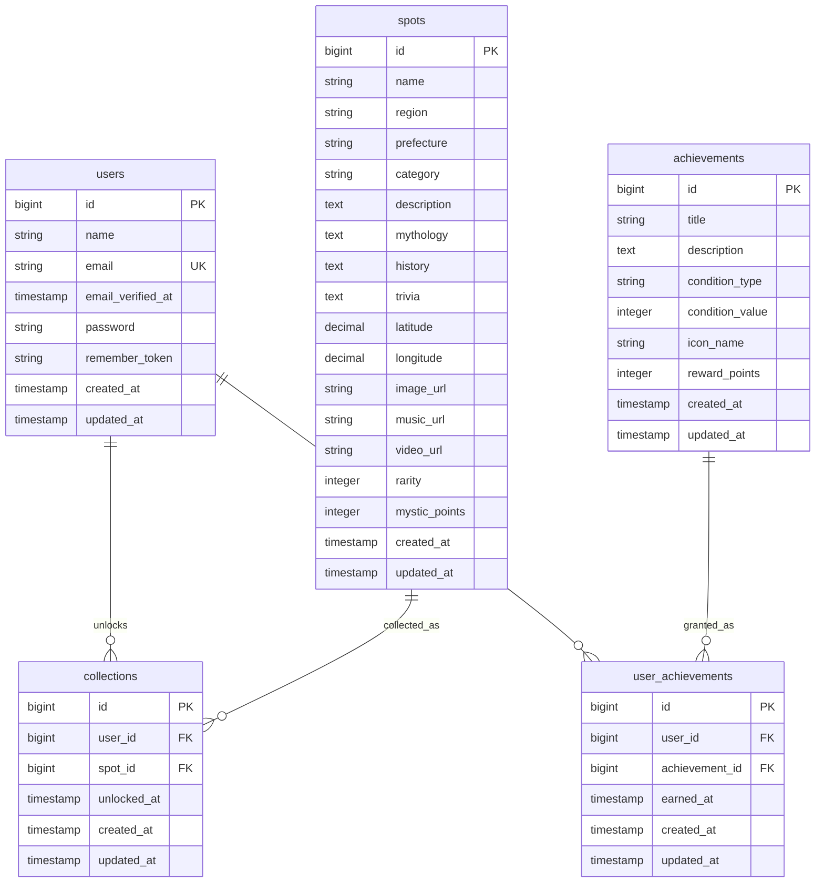

# ER図

## リレーション概要

| 関係 | 内容 |
| --- | --- |
| users - collections | ユーザーが解放したスポット |
| spots - collections | スポットがどのユーザーに解放されたか |
| users - user_achievements | ユーザーが獲得した称号 |
| achievements - user_achievements | 称号の獲得履歴 |

## ユニーク制約

| テーブル | 制約 |
| --- | --- |
| users | `email` をユニーク |
| collections | `user_id` + `spot_id` をユニーク |
| user_achievements | `user_id` + `achievement_id` をユニーク |

## 設計メモ

- `spots.image_url` / `music_url` / `video_url` はnullableにする。
- メディアファイルは保存せず、外部URLのみ参照する。
- `rarity` は1から5の整数で管理する。
- `mystic_points` はスポット解放時の獲得ポイントとして使う。
- MVPではお気に入り専用テーブルを作らず、コレクション解放を主軸にする。お気に入りが必要になった場合は `favorites` テーブルを追加する。
