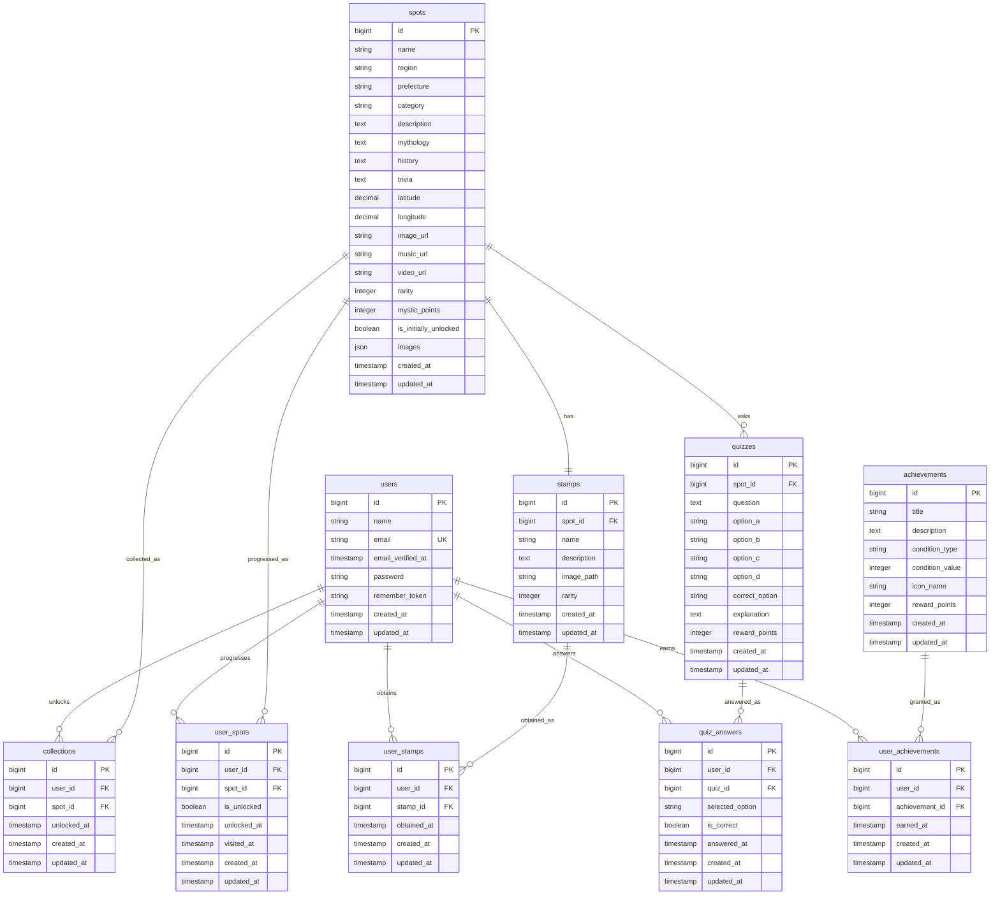

# ER図

## リレーション概要

| 関係 | 内容 |
| --- | --- |
| users - collections | ユーザーが解放したスポット |
| spots - collections | スポットがどのユーザーに解放されたか |
| users - user_spots | ユーザーごとのスポット進行 |
| spots - user_spots | スポットごとの進行状態 |
| spots - stamps | スポットごとの御朱印 |
| users - user_stamps | ユーザーが獲得した御朱印 |
| stamps - user_stamps | 御朱印の獲得履歴 |
| spots - quizzes | スポットごとの神話クイズ |
| users - quiz_answers | ユーザーのクイズ回答履歴 |
| quizzes - quiz_answers | クイズごとの回答履歴 |
| users - user_achievements | ユーザーが獲得した称号 |
| achievements - user_achievements | 称号の獲得履歴 |

## ユニーク制約

| テーブル | 制約 |
| --- | --- |
| users | `email` をユニーク |
| collections | `user_id` + `spot_id` をユニーク |
| user_spots | `user_id` + `spot_id` をユニーク |
| stamps | `spot_id` をユニーク |
| user_stamps | `user_id` + `stamp_id` をユニーク |
| quiz_answers | `user_id` + `quiz_id` をユニーク |
| user_achievements | `user_id` + `achievement_id` をユニーク |

## 設計メモ

- `spots.image_url` / `music_url` / `video_url` はnullableにする。
- メディアファイルは保存せず、外部URLのみ参照する。
- `rarity` は1から5の整数で管理する。
- `mystic_points` は御朱印獲得に伴うスポット解放時の獲得ポイントとして使う。
- 御朱印は神話クイズで4問中3問以上正解した時に `user_stamps` へ保存する。
- 御朱印獲得時に `user_spots.is_unlocked` と `collections.unlocked_at` を更新する。
- 3問正解できなかった場合は、御朱印未獲得の間だけ `quiz_answers` を削除して再挑戦できる。
- MVPではお気に入り専用テーブルを作らず、コレクション解放を主軸にする。お気に入りが必要になった場合は `favorites` テーブルを追加する。
