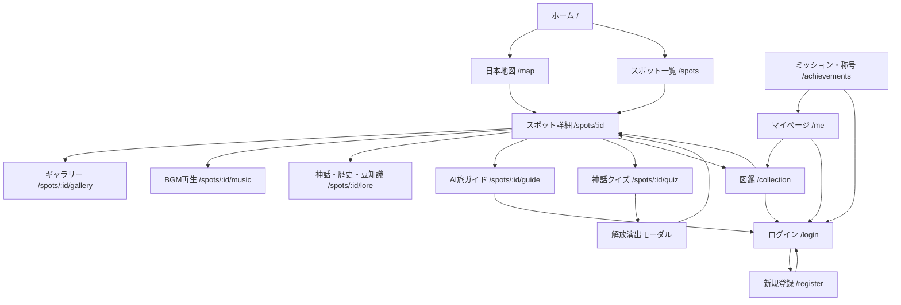

# 画面遷移図

## 代表的なユーザーフロー

### 初回訪問

1. ホームで世界観を見る
2. 「旅を始める」を押す
3. 日本地図へ遷移
4. ピンを選択
5. スポット詳細へ遷移
6. 御朱印を集める場合はログインして神話クイズへ進む

### ログイン後の御朱印獲得・解放

1. スポット詳細を開く
2. 神話クイズへ進む
3. 4問のクイズに回答する
4. 3問以上正解した場合、Laravel APIが `user_stamps` に御朱印を保存する
5. 同時に `user_spots` / `collections` にスポット解放状態を保存する
6. 称号条件を判定する
7. 御朱印獲得・解放演出を表示する

### クイズ再挑戦

1. 神話クイズで4問回答する
2. 3問正解できなかった場合、画面下部に「もう一回」ボタンを表示する
3. 「もう一回」を押す
4. Laravel APIがそのスポットの回答履歴をリセットする
5. ユーザーは御朱印を獲得するまで再挑戦できる
6. 御朱印獲得済みの場合はリトライできない

### AI旅ガイド

1. スポット詳細からAI旅ガイドへ
2. 質問を入力
3. Next.jsからLaravel APIへ送信
4. LaravelがDBからスポット情報を取得
5. Gemini APIへプロンプト送信
6. 回答を画面へ表示

## ページ遷移演出

| 遷移 | 演出 |
| --- | --- |
| ホーム -> 地図 | 星空背景を維持しながらフェード |
| 地図 -> 詳細 | 選択カードが中央へズーム、背景暗転、詳細フェードイン |
| クイズ -> 解放演出 | 御朱印獲得時に背景をぼかし、中央に紫水晶の発光 |
| 一覧 -> 詳細 | カードホバー拡大後、カードを起点にフェード |
| 詳細内タブ | 横スライドと淡い発光 |
