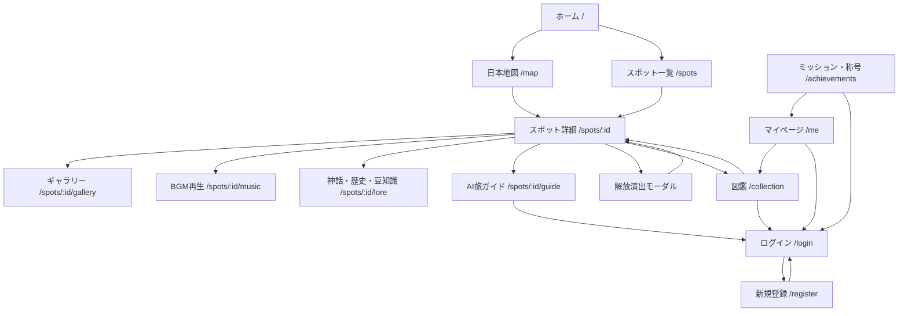

# 画面遷移図

## 代表的なユーザーフロー

### 初回訪問

1. ホームで世界観を見る
2. 「旅を始める」を押す
3. 日本地図へ遷移
4. ピンを選択
5. スポット詳細へ遷移
6. 解放ボタン押下時にログインが必要ならログインへ誘導

### ログイン後の解放

1. スポット詳細を開く
2. 「この絶景を解放する」を押す
3. Laravel APIへ解放リクエスト
4. `collections` に保存
5. 称号条件を判定
6. 解放演出モーダル表示
7. 神秘ポイントと新規称号を表示

### AI旅ガイド

1. スポット詳細からAI旅ガイドへ
2. 質問を入力
3. Next.jsからLaravel APIへ送信
4. LaravelがDBからスポット情報を取得
5. Gemini APIへプロンプト送信
6. 回答を画面へ表示

## ページ遷移演出

| 遷移 | 演出 |
| --- | --- |
| ホーム -> 地図 | 星空背景を維持しながらフェード |
| 地図 -> 詳細 | 選択カードが中央へズーム、背景暗転、詳細フェードイン |
| 詳細 -> 解放演出 | 背景をぼかし、中央に紫水晶の発光 |
| 一覧 -> 詳細 | カードホバー拡大後、カードを起点にフェード |
| 詳細内タブ | 横スライドと淡い発光 |
